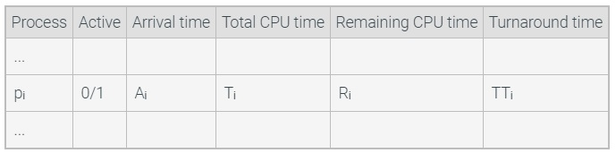

# CS3100-Template-03

## Homework Objective
Implement the three batch scheduling algorithms and calculate the average turnaround time of concurrent processes.

## Instruction
This template gives you starter code for CS 3100 Homework. In this homework, you will implement the three batch scheduling algorithms, FIFO, SJF, SRT, described in "3. Scheduling". 

A simulation mimics the execution of n different processes under different scheduling algorithms. The simulation maintains a table that reflects the current state of the system:



The table is initialized as follows:

* The field "active" indicates whether the process is currently competing for the CPU. The value becomes 1 at the time of process arrival and 0 at the time of process termination. Initially, the value is set to 1 for all processes with arrival time Aᵢ = 0.
* Each Aᵢ is an integer chosen randomly from a uniform distribution between 0 and some value k, where k is a simulation parameter.
* Each Tᵢ is an integer chosen randomly from a normal (Gaussian) distribution with an average d and a standard deviation v, where d and v are simulation parameters.
* Each Rᵢ is initialized to Tᵢ, since prior to execution, the remaining time is equal to the total CPU time required.

The simulation maintains the current time, t, which is initialized to 0 and is incremented after each simulation step. Each simulation step then consists of the following actions:

```
repeat until Rᵢ == 0 for all n processes     /* repeat until all processes have terminated */
   while no process is active, increment t   /* if no process is ready to run, just advance t */
   choose active processes pᵢ to run next
      according to scheduling algorithm      /* Ex: FIFO, SJF, SRT */
   decrement Rᵢ                              /* pᵢ has accumulated 1 CPU time unit */
   if Rᵢ == 0                                /* process i has terminated */
      set active flag of pᵢ = 0              /* process i is excluded from further consideration */
      TTᵢ = t - Aᵢ                           /* the turnaround time of process i is the time 
                                                since arrival, TTᵢ, until the current time t */
compute the average turnaround time, 
  ATT, by averaging all values TTᵢ
```

## Your task
In this homework, you need to implement the three functions `fifo()` `sjf()` and `srt()`.
