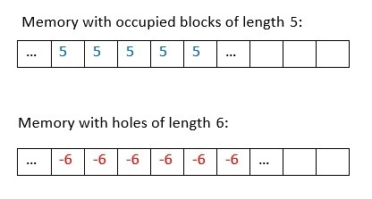

# CS3100-Template-05

## Homework objective
Compare the performance of the memory allocation strategies first-fit, next-fit, best-fit, worst-fit.

## Instruction
This template gives you starter code for CS 3100 Homework. In this homework, you will implement the memory allocation strategies, described in "5.1 Requirements for efficient memory management". 

The simulation mimics a series of request and release operations.

* Physical memory is implemented as an integer array of size n.
* Each allocated block starts with a positive integer, which indicates the length of the block. Each hole starts with a negative integer, -k, where the absolute value k indicates the length of the hole.

* Each request specifies a new block of size s to be allocated, where s is generated at random from a normal (Gaussian) distribution. Values less than 1 and greater than n - 1 are discarded.
* Each release specifies one of the currently allocated blocks, chosen at random.
* Memory utilization is the ratio of space occupied by blocks divided by the total memory size n, and can vary from 0 to 1.

Memory is assumed to be in a steady state and an unbounded stream of requests is always available. Consequently, a change to memory occurs only after a release operation:

* The released block is first coalesced with any neighboring holes.
* Next, zero or more requests may be satisfied, depending on the size of the new hole and the sizes of the requested blocks.

The simulation mimics the above behavior by repeating the following steps:

```
repeat x times                        /* x is the number of simulation steps  */
   repeat until request fails         /* satisfy the next 0 or more requests */
      choose random number s          /* s is the request size chosen from a normal distribution */
      request(s)                      /* attempt to satisfy the request using chosen method; 
                                         count number of holes examined and average the count
                                         over the number of request operations */
   record current memory utilization  /* size of occupied space divided by n */
   select an occupied block i         /* block to be released is selected at random */
   release(i)                         /* release selected block */    
compute average memory utilization
compute average number of holes examined
```

## Your task
* Implement the above simulation for the four allocation strategies first-fit, next-fit, best-fit, worst-fit.
* Choose an average request size, d (```avg_size``` in the code), and a standard deviation, v (```std``` in the code). Use the chosen values to first initialize memory and then during the simulation whenever generating the next request size.
* Initialize memory to contain a set of blocks of normally distributed sizes (using d and v) and placed randomly throughout the memory.
* Run the simulation using different allocation strategies and record the average memory utilizations and the average search times (numbers of holes examined to satisfy a request).
* Repeat the simulation for different values of d and v.
